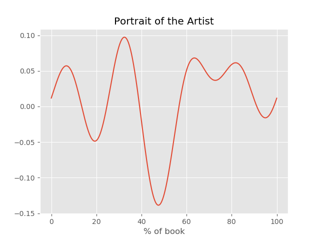

# Arcs

Code to plot the emotional arc of a given novel. For example, A Portrait of the Artist as a Young Man



And if we want to examine that trough in the middle of the book, we can pick out some of the most important sentences from that region:

```
Text Summary 
:--------------------
But what is the fury of those dumb beasts compared with the
fury of execration which bursts from the parched lips and aching
throats of the damned in hell when they behold in their companions in
misery those who aided and abetted them in sin, those whose words sowed
the first seeds of evil thinking and evil living in their minds, those
whose immodest suggestions led them on to sin, those whose eyes tempted
and allured them from the path of virtue.
--------------------

--Last of all consider the frightful torment to those damned souls,
tempters and tempted alike, of the company of the devils.
--------------------

Saint Catherine of Siena once saw a devil and she has written that, rather
than look again for one single instant on such a frightful monster, she
would prefer to walk until the end of her life along a track of red
coals.
--------------------
```
(It's the bit where the priests tell Stephen he's going to hell.)
